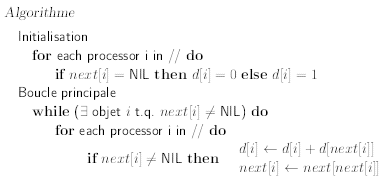

# TD1, SI4 Parallel programming 2022-2023

## Exercice 1

In the course, we have shown 2 versions of the parallel computation of the maximum of n values.

```txt
pourchaque 1 < i < n en parallèle 
   m[i] = TRUE 
pourchaque 1 < i,j < n en parallèle 
   si (t[i] < t[j])
      m[i] = FALSE
pourchaque 1 < i < n en parallèle 
   si (m[i] == TRUE)
      max = t[i] 
```

1. Explain why the proposed CRCW PRAM algorithm that is using n^2 processors can indeed compare all needed values
   together in just one single phase. Remember that to find the maximum of a set of n values, each of them must at some
   point be compared to all the others.  
   Why in the sequential algorithm that you can easily write down, the time complexity ends up being in O(n) (and not O(
   n^2)).

2. Explain why the proposed CRCW PRAM algorithm has to allow CR ?

3. Explain why the proposed CRCW PRAM algorithm has to allow Arbitrary CW ?

4. Sketch how to simulate a C.R. of this algorithm, on an E.R PRAM. For the C.R simulation, write down the complete
   algorithm, assuming the value to be copied to the n processors, is stored in an array of size n, at index 0. Assume
   that n=2^m, so, you can iterate in O(m) parallel steps. Highlight why the simulation has only O(log n) parallel time
   complexity, given the number of data is n.

5. Sketch how to do the same for the Arbitrary C.W, on an E.W. PRAM.

### Answers

1. La complexité de l'algorithme est de O(1) car chaque boucle est parallélisée et donc exécutée en un temps constant
   Dans l'algorithme séquentiel, la complexité est en O(n) parce qu'on a besoin de traverser tout le tableau avec un
   accumulateur stockant le maximum. À la fin, la valeur correspond au maximum du tableau.

2. ```txt
   i = 3 j = 4 // 1 proc T[3] T[4]   
   i = 4 j = 6 // autre proc T[4] T[6]
   ```

   Dans le pire des cas une valeur T[k] va être lue simultanément par n-1 processeurs

3. Arbitrary CW $\rightarrow$ process lisent T[k], $1 \leq k \lt$  
   T[k] avec une autre valeur $\rightarrow$ T[1]  
   **Exemple :** 2 < 1 $\rightarrow$ T[k] < T[1] $\rightarrow$ FALSE  
   False dans m[k], en parallèle, on veut la meme valeur FALSE donc arbitrary  PRAM est suffisante en CW

   Ce que Quentin à noté :  
   L'algorithme proposé doit permettre CR car on doit lire la même valeur par plusieurs processeurs, dans le but d'exécuter une autre boucle en O(1) :

   ```txt
   T[i] < T[j] // dans la seconde boucle
   ```

   Pendant cette instruction nous avons n processeurs qui lisent la même valeur de la cellule du tableau

## Exercice 2

1. What does the following algorithm applied to a chained linked list of elements compute?
   Start with this list once initialized
   
2. What is its parallel time complexity on a PRAM (considering you can use the most powerful PRAM you need) ? Hint : how
   many times is the condition of the while loop executed ?
3. Which PRAM variant is needed at least, not to increase the parallel time complexity ?  
   Hint: is it possible that 2 processes read data of the same list item at the same PRAM instruction ? (consider an
   instruction, eg, an addition with two operands as being one single instruction, i.e., do not decompose even more one
   such operation, like an addition, into its corresponding assembly code)

4. Simulation CR de T[k] pour O(n) processeurs  
   1 processeur lit seulment 1 T[k]  

$$
\begin{aligned}
A[0] &\rightarrow A[1] et A[2] \\
&\space\space\space\space \rightarrow \text{proc 1 duplique A[1] en A[3] et A[4]} \\
&\space\space\space\space \rightarrow \text{proc 2 duplique A[2] en A[5] et A[6]} \\
\end{aligned}
$$

   Copier la valeur de x dans A[0] vers A[0...7] sur une EREW PRAM

     
   **Algo**  
   $n = 2^m$, $A$ de taille $n$, $A[0]$ contient $x$ à copier dans chaque $A[i]$  

   ```py
   for i = 0 to m-1 do
      for j = 0 to 2^i-1 do in parallel
         A[j + 2^i] = A[j]
   ```

## Exercice 3



```py
# init 
for each proessor in # do
   if next[i] = NIL then 
      d[i] = 0 
   else 
      d[i] = 1
# main loop
while (\exists object i t.q next[i] != NIL) do
   for each proessor in # do
      if next[i] != NIL then
         d[i] = d[i] + d[next[i]]
         next[i] = next[next[i]]
```

In the algorithm provided for the parallel computation of the maximum (version 2), the course has shown a classical way
to derive a work optimal PRAM algorithm.  
Write down, using the pseudo PRAM language, the proposed work optimal algorithm.
