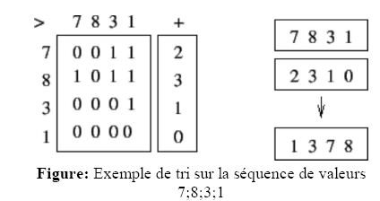

#  TD2, SI4 Parallel programming 2022-2023

- [ TD2, SI4 Parallel programming 2022-2023](#td2-si4-parallel-programming-2022-2023)
  - [Exercice 1](#exercice-1)
    - [Parallelism](#parallelism)
      - [Exercise 1: Find the position of the first occurrence of element X in an unsorted array](#exercise-1-find-the-position-of-the-first-occurrence-of-element-x-in-an-unsorted-array)
        - [Preliminary steps](#preliminary-steps)
        - [First PRAM Version (firstOne)](#first-pram-version-firstone)
        - [Reducing the number of processors](#reducing-the-number-of-processors)
  - [Réponse Exercice 1](#réponse-exercice-1)
    - [First PRAM Version (first One)](#first-pram-version-first-one)
      - [Prelim](#prelim)
      - [Modif](#modif)
      - [Final](#final)
    - [Reducing the number of processors a](#reducing-the-number-of-processors-a)
  - [Exercice 2](#exercice-2)

## Exercice 1  

### Parallelism

Duration 90 minutes
Documents : A single A4 hand„written paper
All answers must be **justified**

#### Exercise 1: Find the position of the first occurrence of element X in an unsorted array

The goal of this exercise is to design a parallel algorithm using a minimal number of processors to find the position
or the first occurrence of an element `X` in an array. For the remaining of the exercise, we well consider only an array
containing either `0` or `1` and we look for the first i. For example, given the array `[0 ,0 ,0 ,1 ,0 ,1 ,0 ,1]`, the algorithm Will return `4` (because indexes start at one).  
Here is a summary of the algorithms and their various steps that will he designed in this exercise.

| Algorithm   | Steps                      |
| ----------- | -------------------------- |
| firstOne    | prelim<br/>modif<br/>final |
| firstOne-V2 | there is a 1 firstOne      |

##### Preliminary steps

1. Give a sequential and iterative version of an algorithm finding the position of the first I in an amay.
2. What iS the time complexity of this algorithm ?

##### First PRAM Version (firstOne)

For the PRAM version, we will use an array B With the same size as the initial array (A) and initially filled with the same values. This first Step is called prelim.

1. Write a parallel algorithm which Clœates B from A (step prelim)
   The rest of the algorithm is composed Of 2 parts which will be studied separately first one (called modif) modifies B as follows :

    ```py
    for all i, j such as i<j
        if B[i]=1 AND B[j]=1 Then 
            B[j]=0
    ```

    1. Show that at the end of modif, array B contains a single at the position we looking for.
    2. Write the algorithm for step modif using $n^2$ processors.

    The second part (called final) takes B as an input and  writes the correct position in a variable called POSITION.
    1. Write a parallcl version of final
    2. How many processors are required ?

    Now that we have all the steps (prelim, modtf, final)we can study the algorithm (cailed firstOne)
    1. For each Step, indicate the time complexity, the required number of processors, and the needed PRAM.
    2. Is this algorithm work optimal ?

##### Reducing the number of processors

The goal of this part is to reduce the number of processors of the previous algorithms to have a more efficient version and create a firstOne—V2. wc Will create an algorithm, called which store '1' in a variable if the given as a parameter contains at least one '1' it is equivalent to a logical OR.

1. Propose a parallel algorithm for there—i which takes O(1) on a CRCW PRAM.

The new version of our algorithm now works like thise Array A is divided into sub•arrays of size X. Each sub-arrayis processed in parallel using there—i and the teturned values are st01ed in C.
We then excute on C which return the position of the first '1' in C. Using this information, we use firstOne on the corresponding sub-array of A which gives us the linal value.

1. Show the execution of the diffcrent steps of the firstOne-V2 algorithm on `[0, 0, 0, 0, 1, 1, 1, 0]` with X=2
2. Give the index Of the first '1' in C, how can you find the position of the first '1' in A ?
3. What is the time complexity of this algorithm ?
4. What could be an optimal value for X (difficult) ?

---

## Réponse Exercice 1

### First PRAM Version (first One)

#### Prelim

1. algo (prelim)

```java
for each i from 1 to n do in parallel
    B[i] = A[i] 
```

2. On élimine au fur et à mesure les 1 qui sont situé à droite car il existe un case avec un indice plus petit contenant un 1 donc cette case va se transformer en un 0. Finalement, on obtient un tableau avec un seul 1, celui le plus à gauche

#### Modif

1. algo (modif)

```java
for each i,j, tel que i<j from 1 to n do in parallel
    if B[i] == 1 AND B[j] == 1:
        B[j] = 0
```

#### Final

1. algo (final)

```java
POSITION = -1
for each i from 1 to n do in parallel
    if B[i] == 1 :
        POSITION = i 
        /* EW car on l'a prouvé au step préscédent que seul une case de B contient un 1 */
```

2. Nous avons besoin de n processeurs pour executer `final`

### Reducing the number of processors a

1. algo (there-i)

```java
isOne = 0 
for each i from 1 to n do in parallel
    if A[i] == 1:
        isOne = 1 // on a besoin d'une CW ARBITRARY ou CONSISTENT
```

2. Notons `k` l'indice dans `C` ou se trouve le 1er `1` cela correspond au sous-tableau de `A` : `A[(k-1) * X + 1]` à `A[k * X]` qui contient le 1er `1`.

3. le temps parallèle reste en O(1) avec ${(\frac{N}{X})}^2$ processeurs CRCW PRAM

4. on a besoin de $X = \sqrt{N}$, on a donc résolu $O((\frac{N}{X})^2) = O(N)$


notes importantes :

$$
Speedup = \frac{t_{seq}}{t_{par}}\\
$$

$$
Work = temps \times nombre \ de \ processeurs
$$

$$
Efficiency = \frac{W_{seq}}{W}
$$

---

## Exercice 2  

Goal  is  to  find  what  is  the  algorithm  used  below  to  sort  using  a  PRAM.  The  expected behaviour is summarized by the figure below.  



Sketch  the  algorithm,  with  the  aim  it  runs  as  quick  as  possible,  without  constraint  on  the
number of required processors of the PRAM. Give precisely which PRAM variant is needed, again,  do  not  constraint  yourself.  Under  the  necessary  PRAM  variant  to  use,  give  precisely what is the parallel time, and the work. To which sort of sequential sorting method does that algorithm belong to ?  
